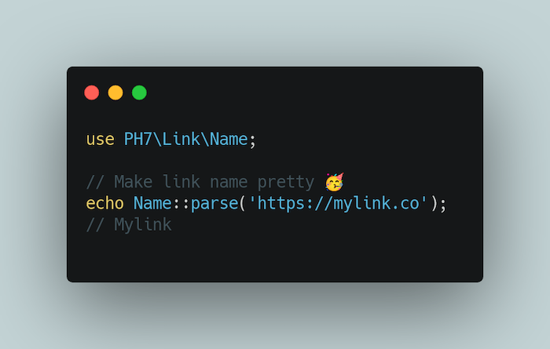

# CuteLinkNames

*A simple class that converts your URLs to link names ✨*


## 👀 Overview




# 🎨 Example

```php
use PH7\Link\Name;

require_once 'vendor/autoload.php';

$url = 'http://ph7.me';
?>

<p>
<a
  href="<?= $url ?>"
  alt="<?= Name::parse($url) ?>"
>
  <!-- Ph7 -->
  <?= Name::parse($url) ?>
</a>
</p>
```


## ⚙️ Requirements

* [PHP v7.3](https://www.php.net/releases/7_3_0.php) or newer 🚀


## 📖 Installation

```bash
composer require ph-7/cute-link-names
```


## 🧑‍🍳 Author

Heyllo 🎉, I'm **[Pierre-Henry Soria](https://ph7.me)**. A **passionate software engineer** based in Adelaide, SA, Australia 🌴

[](https://ph7.me 'Pierre-Henry Soria resume')

[![@phenrysay][twitter-image]](https://twitter.com/phenrysay) [![pH-7][github-image]](https://github.com/pH-7)


## Full video 📺 Me building this library 🔥

[![Watch the video][video-thumbnail]](https://www.youtube.com/watch?v=TgwfrkfXmj0)

👉 **[Click here to watch on YouTube](https://www.youtube.com/watch?v=TgwfrkfXmj0)**


## ⚖️ License

Distributed under [MIT](https://github.com/pH-7/CuteLinkNames/blob/main/LICENSE.md) license 🎉


<!-- GitHub's Markdown reference links -->
[twitter-image]: https://img.shields.io/badge/Twitter-1DA1F2?style=for-the-badge&logo=twitter&logoColor=white
[github-image]: https://img.shields.io/badge/GitHub-100000?style=for-the-badge&logo=github&logoColor=white
[video-thumbnail]: https://i1.ytimg.com/vi/TgwfrkfXmj0/sddefault.jpg
